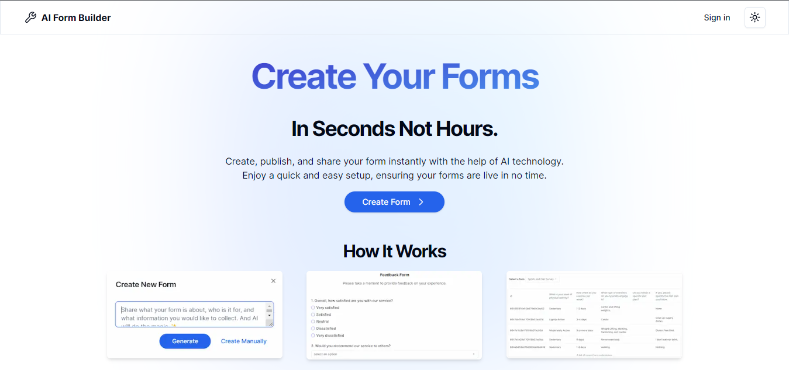

# AI Form Builder

AI Form Builder is a project designed to help users easily generate forms or surveys on any topic using AI. It leverages the power of microsoft/phi-3-medium-128k-instruct model to understand the context and generate relevant questions.



## Technologies Used

- Next.js: A React framework for building modern web applications.
- MongoDB: A source-available cross-platform document-oriented database program.
- Mongoose: An Object Data Modeling (ODM) library for MongoDB and Node.js.
- OpenAI API: An AI model that can generate human-like text.
- Tailwind CSS: A utility-first CSS framework for rapidly building custom user interfaces.
- NextAuth.js: A complete open source authentication solution for Next.js applications.
- Stripe: An online payment processing platform for internet businesses.

## Environment Variables

To run this project, you will need to add the following environment variables to your .env.local file (also see .env.example):

- `GOOGLE_ID`
- `GOOGLE_SECRET`
- `GITHUB_ID`
- `GITHUB_SECRET`
- `NEXTAUTH_URL`
- `NEXTAUTH_URL_INTERNAL`
- `NEXTAUTH_SECRET`
- `MONGODB_URI`
- `NEXT_PUBLIC_STRIPE_PUBLISHABLE_KEY`
- `STRIPE_SECRET_KEY`
- `STRIPE_WEBHOOK_SECRET`
- `NEXT_PUBLIC_BASE_URL`
- `OPEN_ROUTER_API_KEY`

## Getting Started

Follow these steps to get the project up and running on your local machine:

1. Clone the repository:

   ```sh
   git clone https://github.com/Mlika-Gaith/ai-form-builder.git
   ```

2. Navigate into the project directory:

   ```sh
   cd <project-directory>
   ```

3. Install the dependencies:

   ```sh
   npm install
   ```

4. Start the development server:

   ```sh
   npm run dev
   ```

5. Open your browser and navigate to `http://localhost:3000`.

## AI Model

For more information about project AI model and how to get your API key visit ([OpenRouter](https://openrouter.ai/models/microsoft/phi-3-medium-128k-instruct:free))
